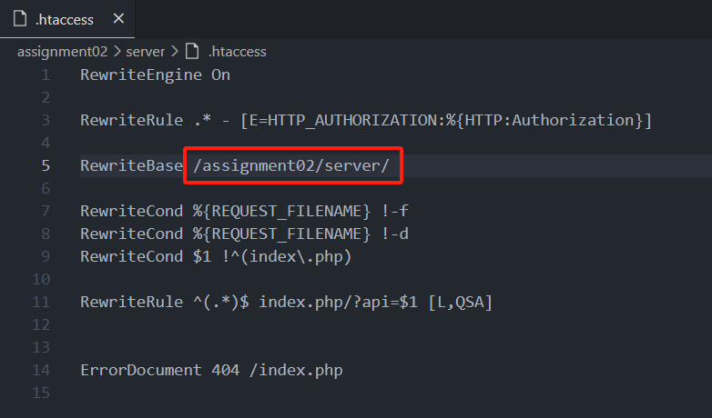
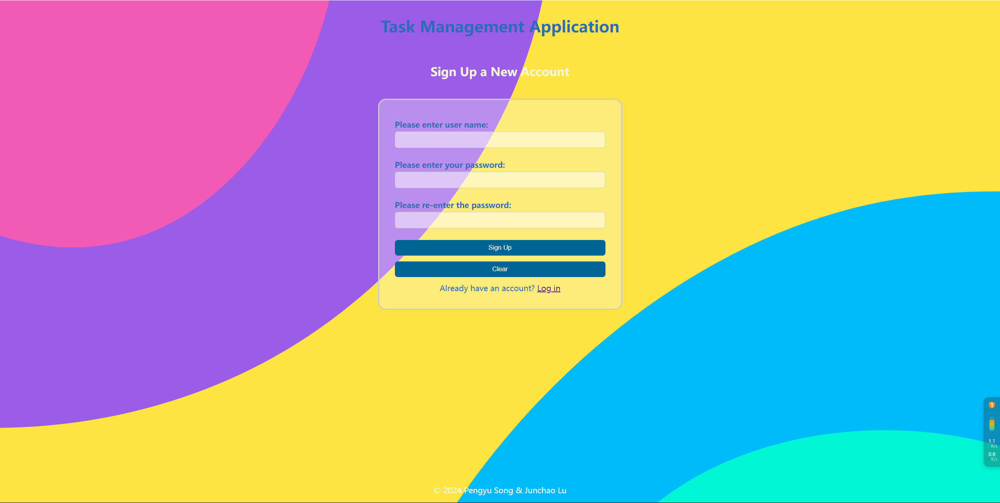
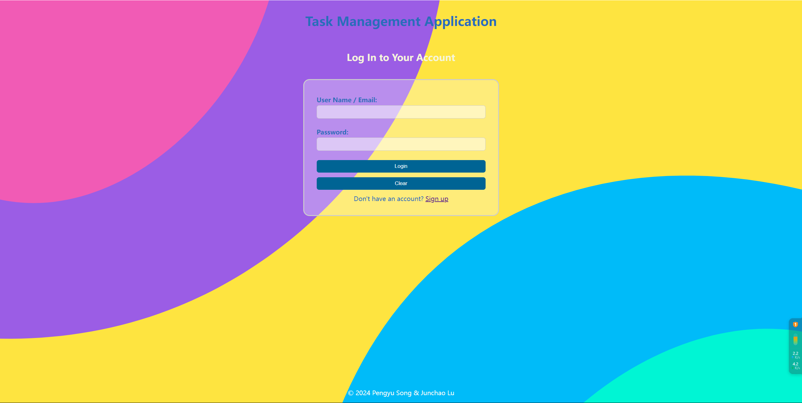
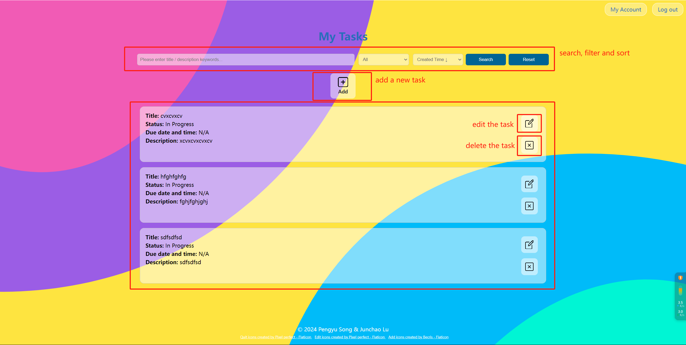
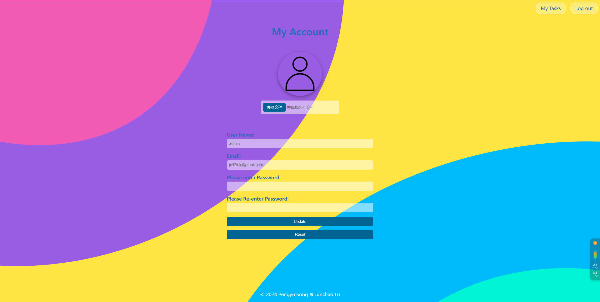

### Group Members
* **Junchao Lu, 041139066**
  * frontend functionality(js) 
  * the backend (php and mysql)
* **Pengyu Song, 041105862**
  * the wireframe, requirements and demands of the project
  * the static web pages (HTML & CSS)
### Setting Up the Project
1. Please extract and put the whole project, "assignment02", under your XAMPP root directory (for example, "/htdocs").
    > **Do Not Change the Folder Name "assignment02"**
    > The project has a single entry of the backend, "/assignment02/server/index.php, which is set in "/assignment02/server/.htaccess":
    > 
    > If the name of the project ("assignment02") is changed, please change the base path of the backend accordingly.
2. Please import "assignment02/taskapi.sql" in your phpMyAdmin to create the database.
3. The configuration of MySQL connection is in "/assignment02/server/config.php", make sure to setup the correct host, user name, password, database name ("taskapi"), and port.
4. The entry point of the project is "http://localhost/assignment02/index.html"
### The Structure of the Project
> assignment02
> ├───assets
> │   └───images
> ├───pages
> ├───scripts
> ├───server
> │   └───controllers
> ├───styles
> ├───wireframes
> ├───index.html
> ├───taskapi.sql
> └───readme.md
* **assets/images**: Images of the project.
* **pages**: HTML pages of the project.
* **scripts**: JavaScript files of the project.
    * **fetch.js**: The customized fetch function.
    * **formUtils.js**: The customized form with validating and setting functionalities.
    * **listUtils.js**: The customized list of tasks.
    * **utils.js** The general utilities, including logout, notification.
    * The JS of the HTML pages are stored in the correspoingd js file.
* **server**
    * **.htaccess**: The customized configuration of php, including: 
        * Settiing up the single entry point to backend as "/assignment02/server/index.php".
        * Setting up the `HTTP_AUTHORIZATION` global variable to catch the request `Authorization` header.
    * **config.php**: The configuration of the backend, including:
        * MySQL connection
    * **controllers/Controller.php**: The base controller handling the request.
    * **controllers/Database.php**: Setup the database connection and prepare basic statments. 
    * **controllers/Task.php and controllers/User.php**, table modals that extend "Database.php".
    * **index.php**: The entry point of backend.
* **styles**: The styles (.css) of the project.
* **wireframe**: The wireframe of the project.
* **index.html**: The entry point of the project.
* **taskapi.sql**: The databse of the project.
* **readme.md**: This file.
### The Project Functionalities
* **Sign Up & Login Page**
    This is a tasks management system. Users can **sign up** a new account and **login** the system with user name and password.
    
    
* **My Tasks**
    * In the home page, a user can see all his/her created task in the list.
    Note: The system will show the first 10 tasks initially, to see more, use the "Load more ..." buton.
    * Your tasks can be searched by keywords in task title and task description, fitlered by task status, and sorted by created time, tile, and due date. The default is all tasks of all status and odering in created time with the newest created first.
        > The basic status of a task can be: "in progress", "completed", "cancelled"
        > If a task is in progress, and the current date and time is over the due date and time, it would be "over due"
        > If a task is cancelled, it is still in the database, if a task is deleted using the delete button, it is removed from the database.
    * In each task, you can edit a task by clicking the "edit" button.
    * In each task, you can delete a task by clicking the "delete" button. 
    
* **My Account**
  * You _cannot_ change your user name.
  * You can change your profile picture.
  * You can change your email.
  * You can change your password.
    